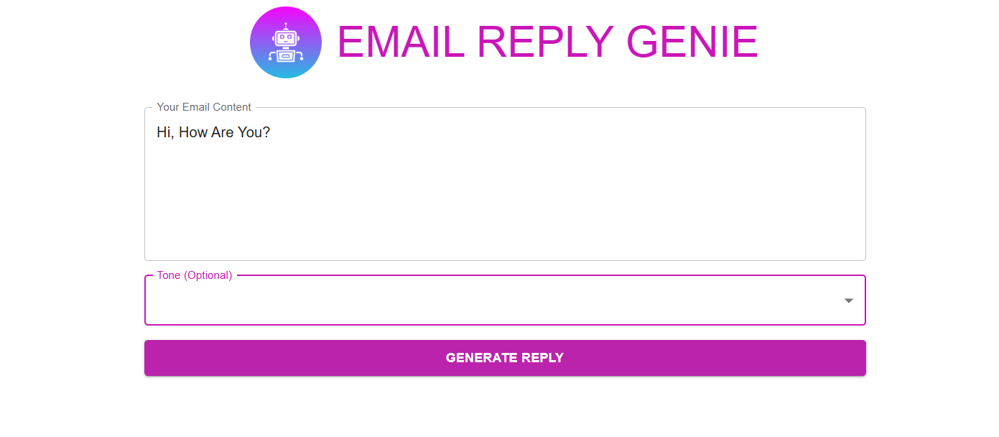
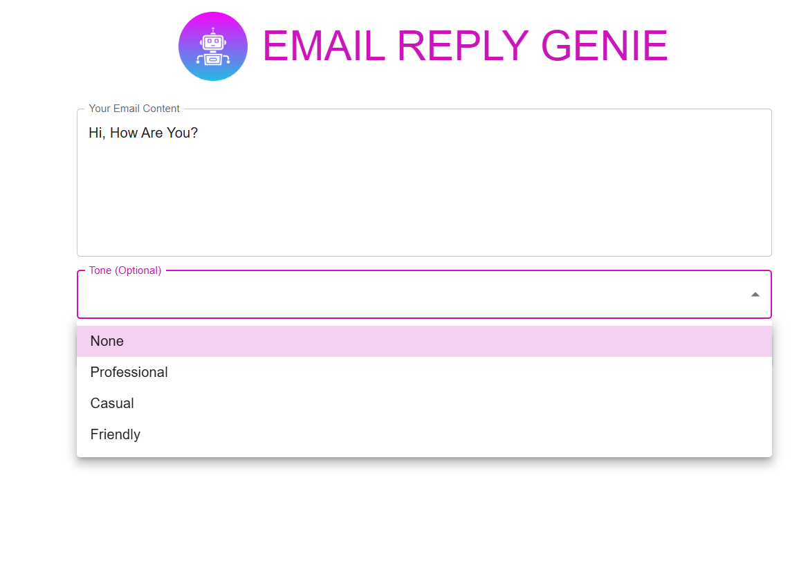
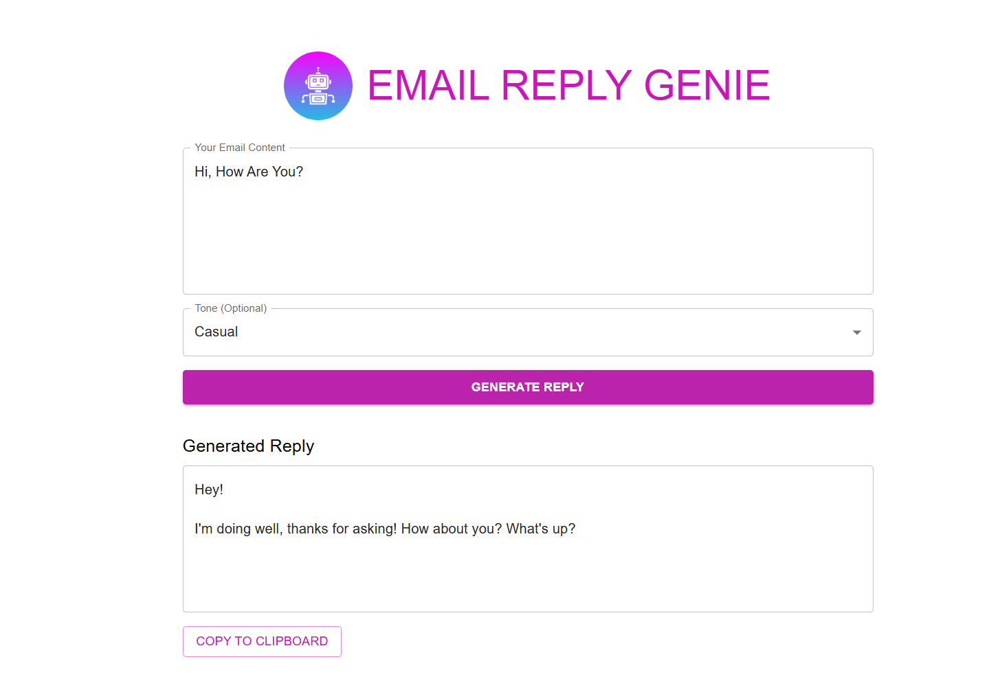
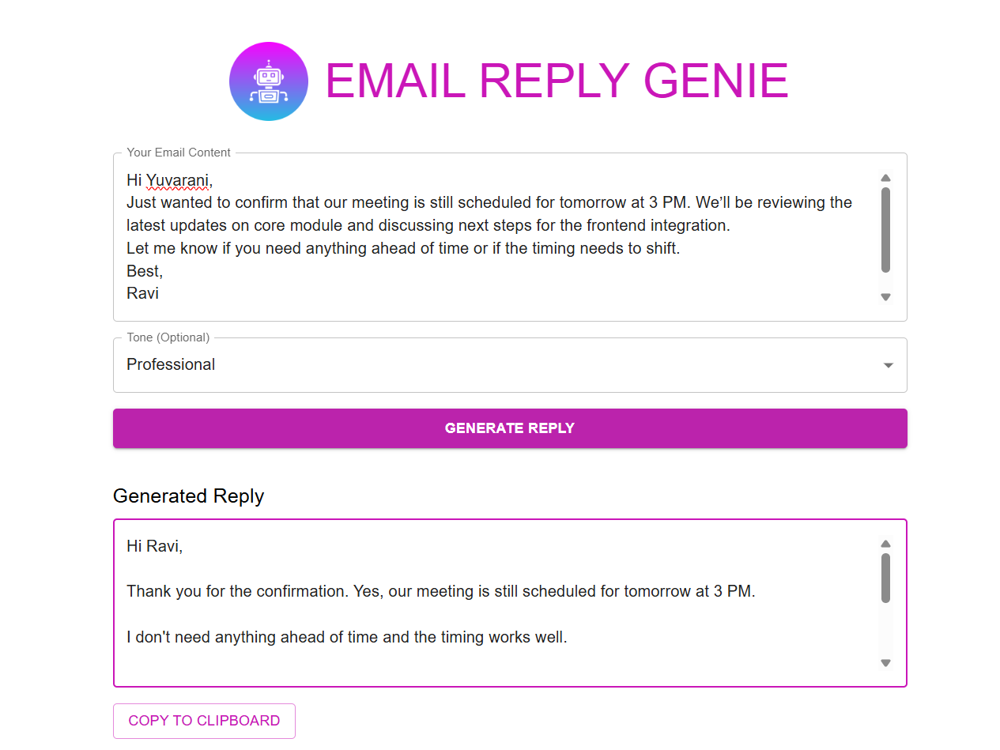

# 🤖 Email Reply Genie
An AI-powered assistant that crafts smart, tone-aware email replies with a touch of magic.

## 🔹 Overview
Email Reply Genie helps users generate thoughtful, context-sensitive replies to incoming emails using AI. Whether you're responding to clients, colleagues, or support tickets, Genie adapts the tone and delivers polished responses instantly.

## 🧠 Key Features

- ✍️ **AI-generated replies** based on original email content  
- 🎭 **Tone customization** — choose professional, casual, or friendly  
- 📋 **Copy-to-clipboard** for fast email workflows  
- ⚡ **Responsive design** built with React + Material UI  
- 🔗 **Backend integration** via REST API (Spring Boot)  
- 📮 **Returns**: AI-generated reply as plain text  
- 🧱 **Modular design** for easy integration with OpenAI or other LLMs  

## 🖼️ Tech Stack

- 🧩 Frontend built with **React** and **Material UI**
- 🔗 **Axios-powered** API calls to the backend
- ⚙️ Backend developed using **Java + Spring Boot**
- 📮 REST endpoint: `/api/email/generate`

## 🔄 Project Flow
A visual walkthrough of how Email Reply Genie works:

### 1️⃣ Home Screen
User lands on the homepage.

---
### 2️⃣ Inbox — Enter Email Content
User pastes or types the email they want to reply to.

---

### 3️⃣ Select Tone
Choose the desired tone: professional, casual, or friendly.

---

### 4️⃣ AI-Generated Reply
Genie crafts a smart, context-aware response.

---

### 5️⃣ Copy to Clipboard
Click to copy the reply and paste it into your email client.

## 💡 Vision
Genie is built for professionals who want to save time without sacrificing tone. It’s fast, intuitive, and brandable—perfect for support teams, freelancers, and anyone who lives in their inbox.

## 🤝 Contributing
Pull requests are welcome! For major changes, please open an issue first to discuss what you’d like to improve.

## 📫 Let’s Connect

I'm currently open to **Java Developer** opportunities in **Dubai/Abu Dhabi**.

  

🔗 **Project Repository**: [YR-Store on GitHub](https://github.com/yuvaranianbu27/YR-Store)

---

Thanks for stopping by! Feel free to reach out for collaboration, feedback, or job opportunities.

📎 [LinkedIn](www.linkedin.com/in/yuvaranianbu)  
📧 Email: yuvaranianbu27@gmail.com

---

